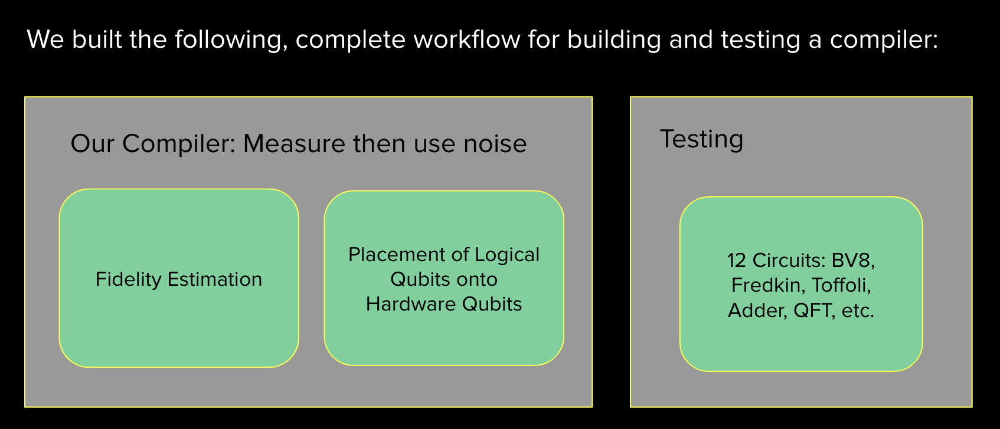
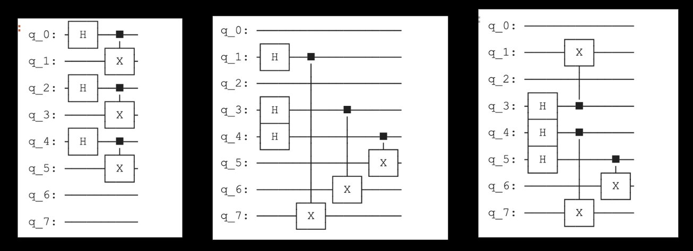
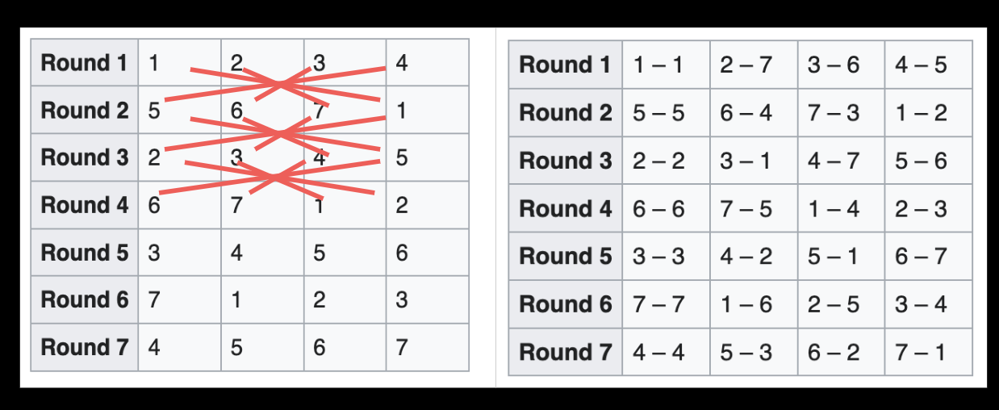
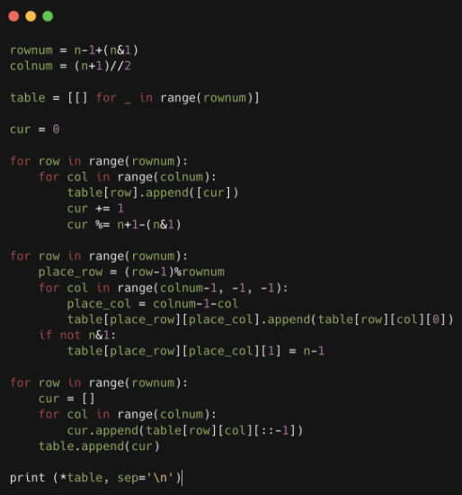
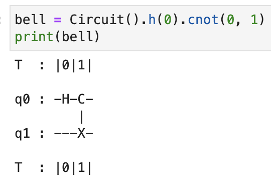
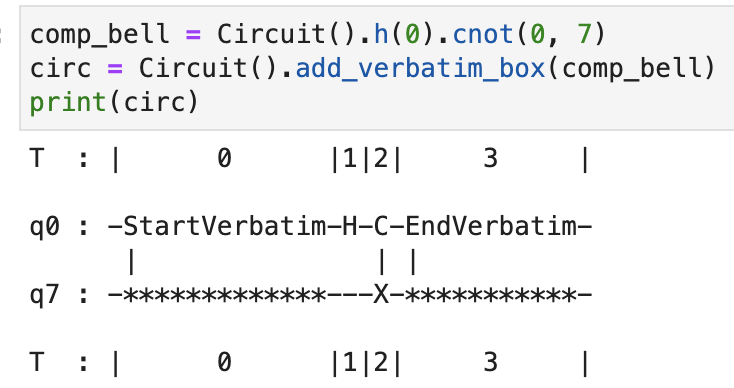

# iQuHack 2024_AWS Challenge: End-to-end Novel Optimization of Qiskit's Compiler
*Team MAICG. Anand John, Evan Kim, Sean Koke, Ryan Yang.*

**The AWS iQuHACK 2024 In-Person Challenge**: For this year's Amazon Braket challenge, we invite you to implement a noise-aware compilation scheme using the Braket SDK which improves the performance of Braket devices. Basically, you're remapping input quantum circuits to make the best use of available qubits, based on which are noisiest. 


## Overview
The goal of the Amazon Braket challenge was to implement noise-aware quantum compilation with the Braket SDK. This was achieved by taking in as input abstract quantum circuits and converting these initializations and gates on *logical qubits* into initalizations and low-level gates onto pairs of *hardware qubits*. The overall system is organized as follows: 
- Motivation: Setup of the problem and hardware
- Part 1: Fidelity Estimation
- Part 2: Optimization of the circuit using estimated fidelities.
- Evaluation: 12 Implemented Quantum Circuits 



## Hardware: The IonQ Processor
Both QuEra's Acquila and IonQ's Harmony computer. QuEra Aquila is a specialized hardware, with a physical array of ultracold Rb atoms. 

<!-- Details about IonQ processor
There were multiple available hardware providers which Braket connects to, IonQ’s Harmony and QuEra’s Aquila. We chose to work with IonQ’s harmony system, but studied both.
Aquila is a …. Harmony is a …. 
https://arxiv.org/pdf/2308.05071.pdf -->

## Part 1: Fidelity Estimation
This subsection's task is as follows: *given a set of qubits, estimate the fidelity of each pair of qubits as precisely as possible*. 

The general solution is to set up and run circuits where the intended value is known, and one can infer properties of the decoherence through the deviation between the observed results and the theoretical result. Assuming that two-qubit gates dominate both time and reliability cost, to achieve this in optimal time, we use the largest possible circuits with a depth of 1, of the form:



Observe that each round, this achieves the maximal $\lfloor \frac{n}{2} \rfloor$ two-qubit operations. Recall that in IonQ, the gates are all-to-all. This differs from more constricted systems, and any complete fidelity estimation must then examine all $\binom{n}{2}$ pairs.

To achieve this, MAICG observes that this problem is, in fact, analagous to the classical problem of tournament round-robin scheduling. This can be achieved with the Schurig Round-Robin algorithm:



With this round-robin schedule, for each round with a game X-Y, we implement a Hadamard gate on $X$ and then a CNOT with control X and target Y. We then evaluated this system against simulations, and discovered that the ground truth values used to instantiate the model were in fact learned correctly, suggesting that our estimation system will also be able to compute all $\binom{n}{2}$ fidelity values in the real IonQ system correctly as well as in optimal round-length.
<!-- This is achieved with the following implementation -->
<!--  -->
<!-- Firstly, we sought to understand noise on quantum circuits
https://github.com/amazon-braket/amazon-braket-examples/blob/main/examples/braket_features/Simulating_Noise_On_Amazon_Braket.ipynb -->
<!-- We set out to measure the current fidelity of the system by creating and running circuits beforehand that would help collect data on bit flips, etc. We observed that the main sources of error were from (1) noise in two-qubit gates, and (2) noise in one-qubit actions. We measured one-qubit error with the following scheme:

Testing for how qubit fidelity scales with the number of gates applied to qubit. Found that error can be well approximated by (qubit fidelity)^(# of single gates applied to qubit) where qubit fidelity is the sqrt(fidelity of two hadamard gate system on qubit)

[diagram of thingy]
As for the two qubit gates, to achieve full coverage of all $\binom{n}{2}$ possible two-qubit actions, we needed to solve the round-robin scheduling problem. Using the Schurig Table[link], we simulated $\approx 2n$ quantum circuits of the form below to measure the fidelity of all pairwise locations for gates.
[diagram of our experiment]
From the simulation, we were able to generate tables of both single qubit fidelities and gate fidelities for all pairs: -->


## Part 2: Compilation Optimization
There is significant literature on quantum computing compiler infrastructure. Qiskit's **NoiseAdaptiveLayout** default compiler is based on the paper Murali, 2019. After closely analyzing the system, whose source code can be found [here](https://github.com/Qiskit/qiskit/blob/stable/0.46/qiskit/transpiler/passes/layout/noise_adaptive_layout.py). We closely analyzed the system, and discovered several areas for improvement, based on breaking down bottlenecks in (1) 


### 2.1: Initial Qubit Mapping
Compilation Overview
Limitations of the paper
GreedyE and GreedyV heuristics mediocre
Limited topology (grid / only nearest neighbors)
Paths only along edges of rectangle 

Heuristic Initialization
We designed a new heuristic for the initialization of the 
Runtime: SWAPs and CNOTs
We recreated Murali 2019 papers 


## Implementing and Testing on 12 Quantum Circuits
Algorithms we tested on.
To test the quality of our compilation, we first ran each algorithm on a circuit with no simulated noise and calculated the result’s normalized overlap with the result of the circuit with the simulated noise. Below is a table of our summarized results from the 12 algorithms.


We implemented a suite of algorithms to test the following 12 algorithms: 
https://en.wikipedia.org/wiki/Bernstein%E2%80%93Vazirani_algorithm


<!-- # Hackathon Tutorial

## A (relatively) simple example

So for an example, let's say I wanted to generate Bell state, which I define as follows: 
```
from braket.circuits import Circuit
bell = Circuit().h(0).cnot(0, 1)
``` 


I want to run this circuit on the IonQ Harmony device and make sure I’m using the best qubits for the job. Therefore, I’ll query the two qubit gate fidelities (T2) like this: 
```
from braket.aws import AwsDevice

harmony = AwsDevice("arn:aws:braket:us-east-1::device/qpu/ionq/Harmony")
l_fid = harmony.properties.provider.properties
l_t2 = l_fid['two_qubit']
print(l_t2)
```
which gives
```
 'two_qubit': {'0-1': {'coupling': {'control_qubit': 0.0, 'target_qubit': 1.0},
   'fCX': 0.9107046823673131},
  '0-7': {'coupling': {'control_qubit': 0.0, 'target_qubit': 7.0},
   'fCX': 0.9926670620929618},
  '1-2': {'coupling': {'control_qubit': 1.0, 'target_qubit': 2.0},
   'fCX': 0.9336247576925645},
  '2-3': {'coupling': {'control_qubit': 2.0, 'target_qubit': 3.0},
   'fCX': 0.9305393721231507},
  '4-3': {'coupling': {'control_qubit': 4.0, 'target_qubit': 3.0},
   'fCX': 0.9631366580296402},
  '4-5': {'coupling': {'control_qubit': 4.0, 'target_qubit': 5.0},
   'fCX': 0.9699989023360711},
  '6-5': {'coupling': {'control_qubit': 6.0, 'target_qubit': 5.0},
   'fCX': 0.9632392875032397},
  '7-6': {'coupling': {'control_qubit': 7.0, 'target_qubit': 6.0},
   'fCX': 0.7673442630631202}}}
```
In this case, the two qubit gate fidelity is highest on the qubit pair ‘0-7’ , where 0 is the target and 7 is the control. So my noise-aware compiler would implement logic to remap my input circuit to run on those qubits. Doing this manually, we would have the following output circuit: <br>


**Hint**: make sure your output circuit uses [verbatim compilation](https://github.com/amazon-braket/amazon-braket-examples/blob/main/examples/braket_features/Verbatim_Compilation.ipynb) so your circuit doesn’t get recompiled again!

## General approach and getting started

For a standard approach to noise-aware compiling in gate-based Noisy Intermediate Scale Quantum (NISQ) devices, you can check out this paper by Murali et al.: https://arxiv.org/abs/1901.11054. For a reference implementation in Qiskit, check out the `NoiseAdaptiveLayout` [method](https://docs.quantum.ibm.com/api/qiskit/qiskit.transpiler.passes.NoiseAdaptiveLayout).

**Hint**: you can access individual 1 and 2-qubit fidelities for the IonQ Harmony device as follows:
```
from braket.aws import AwsDevice

harmony = AwsDevice("arn:aws:braket:us-east-1::device/qpu/ionq/Harmony")
h_fidelities = harmony.properties.provider.fidelity
```
You are also welcome to run a noisy simulation using the DM1 on-demand simulator (check out this [comprehensive example](https://github.com/amazon-braket/amazon-braket-examples/blob/main/examples/braket_features/Simulating_Noise_On_Amazon_Braket.ipynb) to see how) and apply noise-aware compiling to the simulated circuit. We would recommend referring to the Adding noise to a circuit section of the above example, so that you can properly assign noise rates to different simulated qubits, and therefore get an advantage using noise-aware compiling.

The overall goal of the challenge is to implement a noise-aware scheme which improves the performance for a quantum algorithm of your choice over the default compiler (i.e. if you didn’t include your compiler pass) on your chosen Braket device(s). 


## Working on qBraid
[](https://account.qbraid.com?gitHubUrl=https://github.com/iQuHACK/2024_AWS.git)

To access the devices such as IonQ's Harmony for the challenge, we will be providing access and credits via qBraid. So, here are some guidelines:
1. To launch these materials on qBraid, first fork this repository and click the above `Launch on qBraid` button. It will take you to your qBraid Lab with the repository cloned.
2. Once cloned, open terminal (first icon in the **Other** column in Launcher) and `cd` into this repo. Set the repo's remote origin using the git clone url you copied in Step 1, and then create a new branch for your team:
```bash
cd  2024_AWS
git remote set-url origin <url>
git branch <team_name>
git checkout <team_name>
```
3. Use the default environment which has the latest version of `amazon_braket_sdk`. 
4. From the **FILES** tab in the left sidebar, double-click on the `2024_AWS` directory, if you are not there already.
6. You are now ready to begin hacking and [submitting jobs](https://docs.qbraid.com/projects/lab/en/latest/lab/quantum_jobs.html)! Work with your team to complete either of the challenges listed above.

For other questions or additional help using qBraid, see [Lab User Guide](https://docs.qbraid.com/en/latest/), or reach out on the qBraid Slack channel.

# Submission Instructions
To submit your solution, *make sure your fork of this repo is public* and upload a PDF or slideshow explaining your project solution (include a brief intro to the problem, your approach, an outline of your implementation, and your results). All in-person participants will have the opportunity to give a 5-10 minute presentation on their challenge solution in the project presentations (10:30-12:30) on Sunday February 4.  -->
